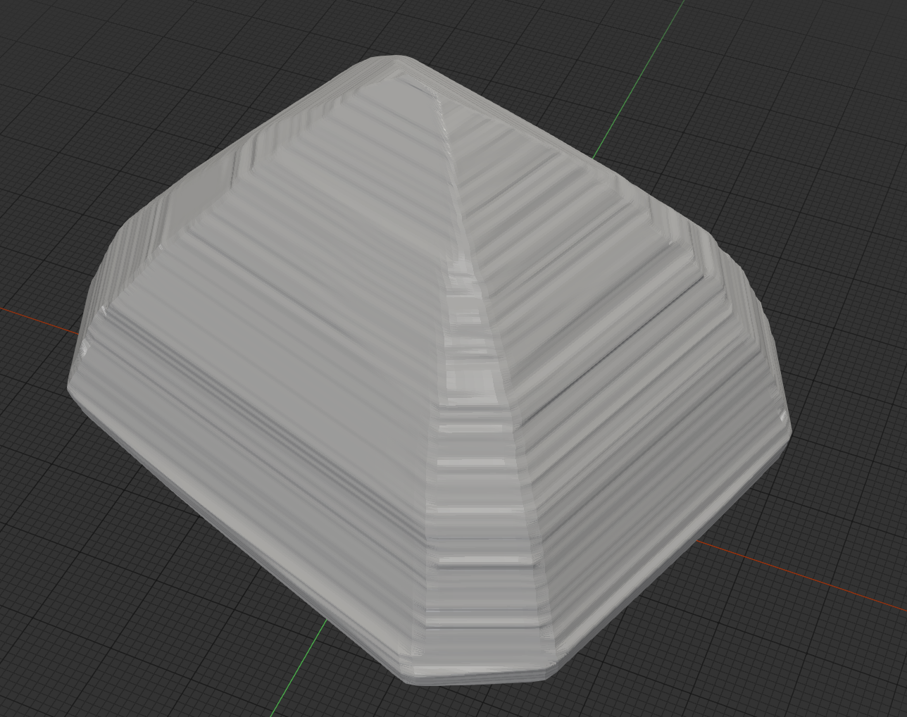

# GemScanner

A gemstone **outline scanner**. A telecentric lens and a machine-vision camera image a
backlit gemstone on a motorized rotary stage; the silhouettes captured around a full
revolution are fused into a watertight 3-D mesh by **shape-from-silhouette** (visual
hull). The result is an `.stl` you can measure, catalogue, or 3-D print.



*A raw scan showing horizontal "strike line" terracing — a reconstruction artifact
the [selectable methods](#reconstruction-methods) remove while keeping real facets.*

## How it works

1. A collimated backlight makes the gem a dark silhouette against a bright field.
2. The stage rotates the gem through 360°, capturing ~180 views.
3. Each image row becomes a horizontal cross-section carved by intersecting the
   silhouette strips from every view (the visual hull).
4. The cross-sections are lofted (or marching-cubed) into a closed mesh and exported.

## Highlights

- **Pure-Python reconstruction core** — no hardware needed to reconstruct an existing
  scan or to run the full test suite (synthetic cameras stand in for the rig).
- **PySide6 GUI** — a guided per-gem wizard (mount → align → calibrate → scan →
  reconstruct) with live preview, exposure/gain control, and a reconstruction-method
  picker.
- **Selectable reconstruction methods** — trade speed for surface quality, from a fast
  raw visual hull to an anti-aliased volumetric hull (see below).
- **Faceted reconstruction** — for step-cut / faceted stones, an unsupervised
  facet-plane recovery (`method="facet"`) that fits the silhouette support function
  into a watertight polyhedron of planar facets, girdle ring included.
- **Swappable camera backends** — `gentl` (Harvesters/GenICam), `baumer` (neoAPI),
  `opencv` (USB), or `mock` — a one-line config change.
- **ESP32-C6 motion firmware** — a USB-CDC line protocol driving a 5-phase stepper
  (`firmware/`).

## Repository layout

| Path | What |
|------|------|
| `gemscanner/reconstruction/` | Visual hull, soft hull, faceted-plane fit, mesh lofting, de-terracing |
| `gemscanner/vision/` | Silhouette extraction |
| `gemscanner/gui/` | PySide6 app (wizard, preview, panels, worker thread) |
| `gemscanner/camera/` | Camera backends + factory (`gentl`/`baumer`/`opencv`/`mock`) |
| `gemscanner/motion/` | Rotary stage client speaking the firmware protocol |
| `gemscanner/acquisition/` | Step-and-settle scan controller, pre-scan FoV check |
| `gemscanner/calibration/` | Rotation-axis probing |
| `gemscanner/synthetic/`, `gemscanner/testing/` | Synthetic ellipsoid scans + fakes |
| `firmware/` | ESP-IDF ESP32-C6 motion controller (see `firmware/README.md`) |
| `docs/` | Design specs, camera notes, usage |

## Install

Targets **Python 3.12** on Windows (Open3D has no 3.13 wheel yet).

```powershell
py -3.12 -m venv .venv
.\.venv\Scripts\python -m pip install -e ".[dev]"
```

Runtime dependencies: `numpy`, `scipy`, `opencv-python`, `trimesh`, `open3d`,
`scikit-image`, `pyserial`, `pyyaml`, `harvesters`, `PySide6`. The GenTL camera backend also needs a
vendor `.cti` producer installed on the machine (e.g. Baumer's `bgapi2_gige.cti`).

## GUI

The primary interface. It reads `project.yaml` (camera backend, serial port, mm/px,
steps-per-rev, and the list of gems):

```powershell
.\.venv\Scripts\python -m gemscanner.cli gui          # or: gemscanner gui
```

Work through the left-hand wizard for each gem: **Mount → Align lighting → Holder mask
→ Calibrate axis → Scan → Reconstruct**. Pick a method in the **Reconstruction**
dropdown before clicking *Reconstruct*; the result is written to
`scans/<gem>/gem.stl`. Reconstruction reads the already-captured frames, so you can
scan once and re-reconstruct with different methods to compare.

## Reconstruction methods

The horizontal "strike lines" (terracing) sometimes seen on a raw scan are an artifact
of carving each image row independently — not real gem geometry. These options remove
them while preserving genuine facet edges (all measured on a real 17 µm/px scan):

| GUI choice | `ReconstructionParams` | What it does | Terracing¹ | Cost |
|------------|------------------------|--------------|-----------|------|
| Fast (visual hull) | *(defaults)* | Raw per-slice visual hull | baseline | fast |
| Smooth edges *(recommended)* | `edge_median_rows=9` | Median-smooths the silhouette edge per view (image space) | ≈ −80% | fast |
| Smooth surface | `axial_median_rows=9` | Median-smooths the ring radius field along z (mesh space) | ≈ −85% | fast |
| High accuracy | `method="soft_hull"` | Anti-aliased volumetric visual hull + marching cubes | ≈ −70%, sharper facets | minutes |
| Faceted gem (planar) | `method="facet"` | Fits the support function into planar facets → watertight polyhedron | n/a² | seconds |

¹ Reduction of the horizontal-band artifact on a real 17 µm/px scan; larger median
windows remove more (edge window 15 reaches ≈ −96%).

² The faceted method doesn't carve per-slice rings, so terracing doesn't arise — it
recovers the facet planes directly.

Edge/axial median use rank-rejection of per-row outliers, so facets stay crisp;
measured impact on volume is ≤ +0.24% and on bounding dimensions effectively zero.
The soft hull is the most accurate (synthetic-ellipsoid volume error −0.8% vs −2.7%
for the raw hull) and produces a watertight single-body mesh; it requires
`scikit-image`.

The **faceted** method is for genuinely faceted stones (step cuts, brilliants). Instead
of carving cross-sections it detects each facet's azimuth from the slice-polygon edges,
segments the per-view support function `H(z)` into planar tiers, recovers the girdle
band, and assembles the resulting half-spaces into a single watertight polyhedron of
flat facets — in seconds, with no soft-hull seed. On the gem04 reference scan it
recovers 56 facets (including the faceted girdle ring) at 5 µm median per-facet fit,
with bounding-box extents within 16/40/77 µm (X/Y/Z) of the visual-hull mesh. It is
best on clean step/brilliant cuts; rounded cabochons should use one of the hull methods.
Requires `scipy`.

## CLI

```powershell
# Reconstruct a mesh from an existing scan dataset (no hardware)
.\.venv\Scripts\python -m gemscanner.cli reconstruct scans\gem01 -o gem.stl

# View a mesh in an interactive Open3D window
.\.venv\Scripts\python -m gemscanner.cli view gem.stl

# Full bench scan: config -> prescan -> capture 360 deg -> reconstruct -> gem.stl
.\.venv\Scripts\python -m gemscanner.cli scan -c config.example.yaml -o scans\gem01
```

## Configuration

`config.example.yaml` (for the `scan` CLI) and `project.yaml` (for the GUI) select the
camera backend, serial port, scan parameters, and calibration file. For the legacy
Baumer EXG50 GigE camera use `camera_backend: gentl` with a `cti_path` to a GenTL
producer; neoAPI (`baumer`) only supports the newer CX/X families. Swapping to a USB
camera is a one-line change to `opencv`.

## Tests

```powershell
.\.venv\Scripts\python -m pytest -q
```

All orchestration, protocol, reconstruction, and GUI logic is host-tested in-process
via `FakeFirmware` (the firmware protocol contract), `MockCamera`, and `SceneCamera`
(which links the fake motion angle to a rendered ellipsoid silhouette). Real serial
I/O, the OpenCV/Baumer/GenTL cameras, and the Open3D window are **bench-verified** on
hardware.

## Bench bring-up

With the camera and collimated backlight aligned, the stage/driver/ESP32 powered, and a
`calibration.json` (axis column, mm/px, steps-per-rev) produced from the calibration
routines, run the GUI wizard or the `scan` CLI. The pre-scan FoV check aborts (naming
the clipping angle) if the gem leaves the frame at any rotation; otherwise it captures
the revolution, reconstructs, and writes a watertight `gem.stl`. Compare the
bounding-box extents against caliper measurements within the calibrated tolerance.
